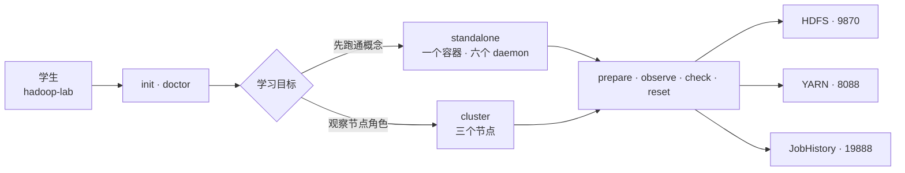

# Hadoop Lab

[中文](README.md) · [English](README_EN.md)

**把环境准备、服务观察、MapReduce 执行、节点故障与恢复组织成一条可重复的 Hadoop 学习路径。**

[](https://github.com/QianQIUlp/docker-hadoop-cluster/actions/workflows/ci.yml)
[](https://hadoop.apache.org/)
[](https://github.com/QianQIUlp/docker-hadoop-cluster/pkgs/container/hadoop-cluster-3.4.1)
[](LICENSE)

Hadoop Lab 是面向课堂、自学和本地实验的 Hadoop 3.4.1 环境。初学者只需要一个入口就能检查电脑、启动服务、运行第一份 MapReduce 作业、判断故障并安全恢复；需要理解节点角色时，再从单容器切换到三节点完全分布式布局。

> [!IMPORTANT]
> 这是教学与本地实验工具，不是生产 Hadoop 平台。它不提供 Kerberos、NameNode HA、多机编排、备份、容量规划或运行 SLA。Web 与 RPC 端口默认仅绑定 `127.0.0.1`。

## 第一次运行

要求：Docker Desktop，或包含 Docker Compose v2 的 Docker Engine。Windows 用户可在 PowerShell 中使用 `hadoop-lab.ps1`；它会调用 Git for Windows 自带的 Bash。

```bash
git clone https://github.com/QianQIUlp/docker-hadoop-cluster.git
cd docker-hadoop-cluster

./hadoop-lab init
./hadoop-lab doctor
./hadoop-lab up standalone
./hadoop-lab demo wordcount
```

普通启动会拉取公开的多架构 GHCR 镜像，不会下载并编译 Hadoop。修改了 `Dockerfile`、`entrypoint.sh` 或镜像内配置后，才使用：

```bash
./hadoop-lab up standalone --build
```

## 两种学习模式

| 模式 | 适合场景 | 布局 | 启动命令 |
|---|---|---|---|
| `standalone` | 第一次接触、低内存电脑、快速演示 | 六个 Hadoop daemon 位于一个容器 | `./hadoop-lab up standalone` |
| `cluster` | 节点角色、SSH、DataNode 故障实验 | 三个容器模拟完全分布式集群 | `./hadoop-lab up cluster` |

三节点角色如下：

| 节点 | Hadoop 服务 |
|---|---|
| `hadoop1` | NameNode、DataNode |
| `hadoop2` | ResourceManager、NodeManager、DataNode |
| `hadoop3` | SecondaryNameNode、JobHistoryServer、DataNode |

两种模式使用同一个镜像，通过运行时角色参数启动不同 daemon。



## 一个入口完成日常操作

```text
./hadoop-lab init                         创建本地 .env，不覆盖现有设置
./hadoop-lab doctor [MODE]                检查 Docker、内存、端口和 Compose
./hadoop-lab up [MODE]                    拉取公开镜像、启动并等待健康
./hadoop-lab status [--json]              验证容器和每个预期 daemon
./hadoop-lab open [--launch]              显示或打开三个观察页面
./hadoop-lab shell [NODE]                 以非 root hadoop 用户进入节点
./hadoop-lab logs [NODE] [--tail N]       查看集群或单节点日志
./hadoop-lab diagnose                     生成脱敏诊断包
./hadoop-lab stop [MODE|all]              停止并保留数据
./hadoop-lab reset MODE                   重建运行时并保留数据
./hadoop-lab reset MODE --data            经确认后删除该模式的命名卷
```

`doctor`、`status` 和 `lesson check` 在失败时返回非零退出码，因此教师脚本和 CI 可以复用同一套检查。旧的 `scripts/up.sh`、`status.sh`、`shell.sh` 仍保留为兼容入口。

## 从结果进入原理：七个实验

```bash
./hadoop-lab lesson list
./hadoop-lab lesson start 00-first-run
./hadoop-lab lesson check 00-first-run
```

| 实验 | 学生完成后能够解释 | 模式 |
|---|---|---|
| 00 First run | 容器健康、Java daemon 和 Web UI 的区别 | 单节点 |
| 01 HDFS basics | HDFS namespace 与宿主机文件的区别 | 任意 |
| 02 WordCount | 输入、YARN 应用与 reducer 输出的关系 | 任意 |
| 03 YARN observation | ResourceManager 与 JobHistory 的职责 | 任意 |
| 04 Cluster roles | 六个服务如何分布到三个节点 | 三节点 |
| 05 Failure recovery | DataNode 离线、观察与恢复过程 | 三节点 |
| 06 Configuration | `.env`、XML 模板与生效配置的关系 | 任意 |

每个实验都有目标、预期证据、解释、自动检查和最小范围 reset。详见 [`labs/`](labs/README.md)。WordCount 只替换 `/labs/wordcount/output`，不会删除学生可能正在使用的通用 `/output`。

## 可观察、可诊断、可恢复

```bash
./hadoop-lab status
./hadoop-lab logs hadoop-standalone
./hadoop-lab diagnose
```

状态命令同时检查 Docker health 和每个节点应有的 JVM 进程，并给出具体下一步。诊断包包含版本、精简容器状态、检查结果和最近日志，不包含 `.env` 或完整容器环境；分享前仍应人工检查。

停止容器默认保留命名卷。只有 `reset MODE --data` 会删除所选模式声明的数据卷，并要求交互式确认或显式 `--yes`。

## Web 观察面

- NameNode / HDFS：<http://localhost:9870>
- ResourceManager / YARN：<http://localhost:8088>
- SecondaryNameNode：<http://localhost:9868>
- MapReduce JobHistory：<http://localhost:19888>

实际端口可在 `.env` 中调整。`HOST_BIND_IP=127.0.0.1` 是安全默认值。

## 配置与持久化

- `.env`：镜像、端口、角色地址、JVM、HDFS 与健康检查参数。
- `conf/`：`core-site.xml`、`hdfs-site.xml`、`yarn-site.xml`、`mapred-site.xml` 和 `workers` 模板。
- Docker 命名卷：NameNode 元数据、DataNode blocks、YARN 与 JobHistory 状态。
- 共享 SSH 命名卷：为教学中的 `start-*.sh` 和跨节点观察提供互信。

默认 `DFS_REPLICATION=1`，让单节点第一课不会从欠副本警告开始；三节点课程可将它调整为 3 观察副本行为。

详细资料：

- [架构与边界](docs/architecture.md)
- [配置参考](docs/configuration.md)
- [运行与恢复](docs/operations.md)
- [故障排查决策表](docs/troubleshooting.md)
- [90 分钟教学建议](docs/teaching-guide.md)
- [个人网站展示素材](docs/project-showcase.md)

## 开发与验证

```bash
shellcheck hadoop-lab scripts/*.sh examples/*.sh
bash tests/test-cli.sh
docker compose --env-file .env.example -f docker-compose.standalone.yml config --quiet
docker compose --env-file .env.example -f docker-compose.yml config --quiet
```

GitHub Actions 还会实际启动 standalone，等待健康，运行 WordCount，并验证 HDFS 输出；三节点 smoke test 验证三个容器及角色进程。镜像发布流程继续执行多架构构建、Trivy、SBOM、provenance 和 Cosign 签名。

## 项目边界与支持

- 本地学习问题或可复现 bug：使用 GitHub Issue 模板，并附 `diagnose` 包中经过检查的相关文本。
- 安全问题：按照 [SECURITY.md](SECURITY.md) 私下报告。
- 贡献流程：[CONTRIBUTING.md](CONTRIBUTING.md)。
- 变更记录：[CHANGELOG.md](CHANGELOG.md)。

Apache-2.0，见 [LICENSE](LICENSE)。
