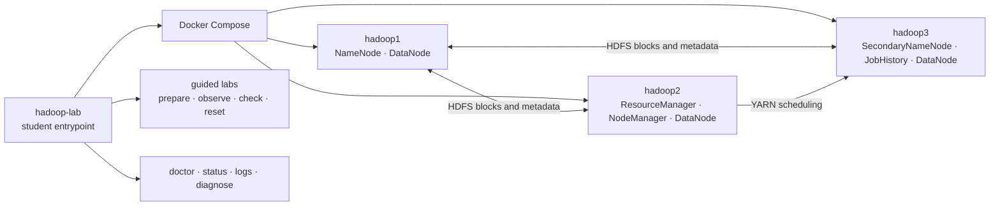

# Architecture and teaching boundaries

## Service map

Standalone mode runs the same six daemons in one container. It removes the
hardware cost of the three-node layout without changing the HDFS/YARN concepts
students observe. Cluster mode makes process placement and node failure visible.

The published image supplies the large Hadoop runtime. Compose mounts this
checkout's `conf/` templates and `entrypoint.sh` read-only, so lifecycle behavior
and lessons stay aligned with the repository even before the next image release.

## State ownership

| State | Location | Reset behavior |
|---|---|---|
| Source configuration | `.env`, `conf/` | kept |
| Container runtime | Docker containers/network | `reset` removes |
| Hadoop data | named volumes | kept unless `reset --data` |
| Lesson output | `/labs/*` in HDFS | lesson reset removes only its namespace |
| Diagnostics | `diagnostics/*.tar.gz` | local, ignored by Git |

## Deliberate boundaries

This is a local teaching and experimentation environment. It does not claim to
provide production authentication, Kerberos, high availability, multi-host
orchestration, capacity planning, backups, upgrades or operational SLAs. Ports
bind to loopback by default. These boundaries keep the learning surface small
and make destructive experiments recoverable.
